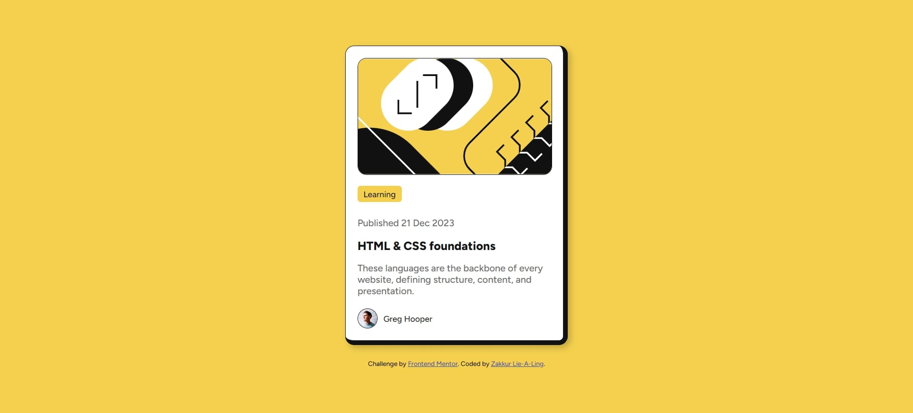

# Frontend Mentor - Blog Preview Card Solution

This is my solution to the [Blog Preview Card challenge on Frontend Mentor](https://www.frontendmentor.io/challenges/blog-preview-card-ckPaj01IcS). Frontend Mentor challenges help you improve your coding skills by building realistic projects.

## Table of Contents

- [Overview](#overview)
  - [The Challenge](#the-challenge)
  - [Screenshot](#screenshot)
  - [Links](#links)
- [My Process](#my-process)
  - [Built With](#built-with)
  - [What I Learned](#what-i-learned)
  - [Useful Resources](#useful-resources)
- [Author](#author)

## Overview

### The Challenge

The challenge was to build a responsive blog preview card that matches the provided designs for mobile (375px) and desktop (1440px) layouts. The card includes an image, a category tag, a publication date, a title with a hover state, a description, and an author section with an avatar. The design also features custom border styling with thicker borders on the right and bottom.

### Screenshot



### Links

- **Live Site URL**: [https://zakkur17.github.io/blog-preview-card-main/]
- **Solution URL**: [https://github.com/Zakkur17/blog-preview-card-main.git]

## My Process

### Built With

- Semantic HTML5 markup (e.g., `<article>`, `<header>`, `<footer>`, ``, `<a>`)
- CSS custom properties for colors and spacing
- Flexbox for layout and alignment
- Mobile-first workflow
- Google Fonts: Figtree

### What I Learned

This project helped me solidify several key skills:

- **Semantic HTML**: Using `<article>`, `<header>`, and `<footer>` improved the structure and accessibility of the card. For example:
  ```html
  <article class="card">
    <header>
      <span class="tag">Learning</span>
      <p class="published-date">Published 21 Dec 2023</p>
    </header>
    <h2 class="title"><a href="#">HTML & CSS foundations</a></h2>
    <p class="description">These languages are the backbone of every website, defining structure, content, and presentation.</p>
    <footer class="author">
      
      <span class="author-name">Greg Hooper</span>
    </footer>
  </article>
  ```
- **Responsive Design**: Ensuring the card scales properly from 320px to large screens using percentage-based widths and `max-width`.
- **Custom Borders**: Applying different border widths to specific sides of the card using `border-width: 1px 8px 8px 1px`.

### Useful Resources

- [MDN Web Docs](https://developer.mozilla.org/en-US/) - Great reference for HTML semantics and CSS properties.
- [CSS Tricks - Flexbox Guide](https://css-tricks.com/snippets/css/a-guide-to-flexbox/) - Helped me master Flexbox for this layout.
- [Google Fonts](https://fonts.google.com/) - Used to import the Figtree font for the project.

## Author

- Name: Zakkur Lie-A-Ling
- Frontend Mentor: [@Zakkur17](https://www.frontendmentor.io/profile/Zakkur17)
- GitHub: [@Zakkur17](https://github.com/Zakkur17)
```

---

### Notes for Customization
- **Screenshot Path**: The screenshot is set to `./assets/images/blog-preview-card-preview.jpg`. Update this path if your screenshot is stored in a different location.
- **Live Site and Solution URLs**: Replace the placeholders (`https://your-username.github.io/blog-preview-card/` and `https://github.com/your-username/blog-preview-card`) with your actual project URLs.
- **What I Learned**: I’ve included a sample HTML snippet and key takeaways based on the Blog Preview Card project. Feel free to adjust these to reflect your specific experiences or code.
